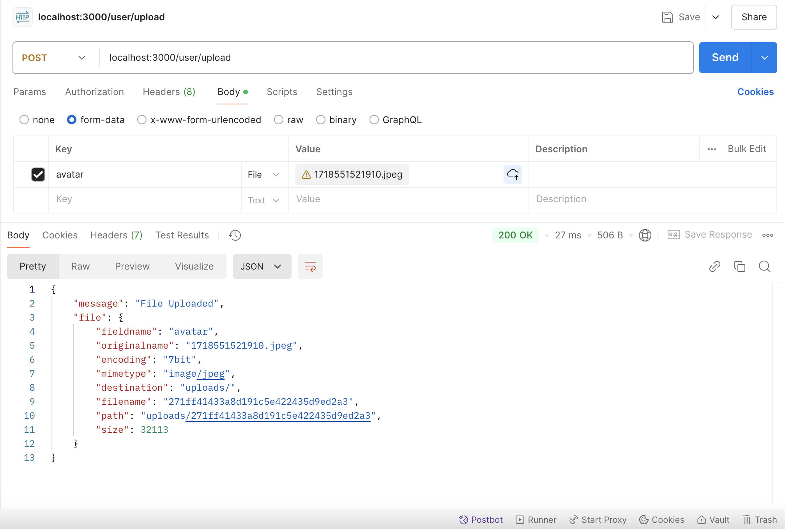
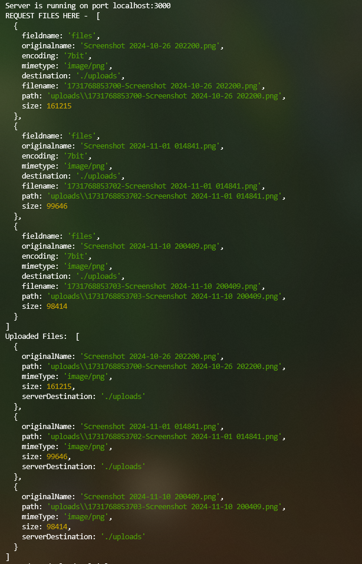
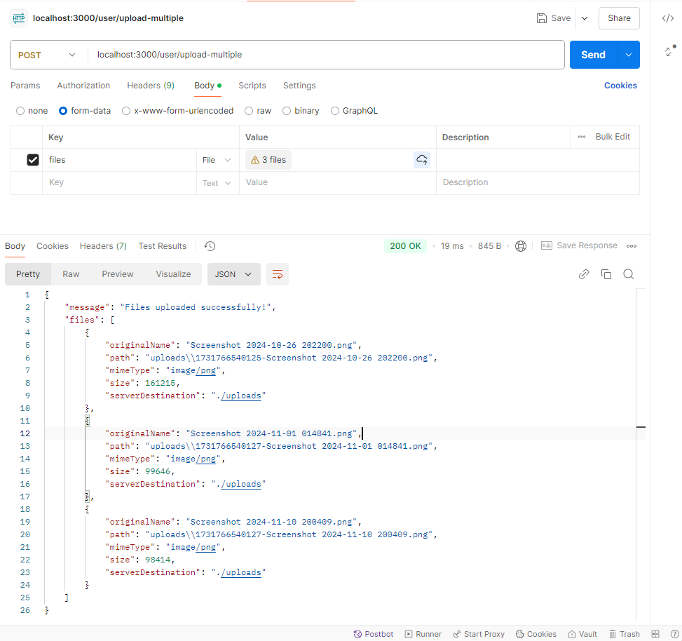
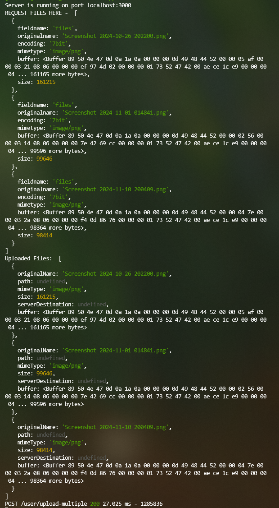
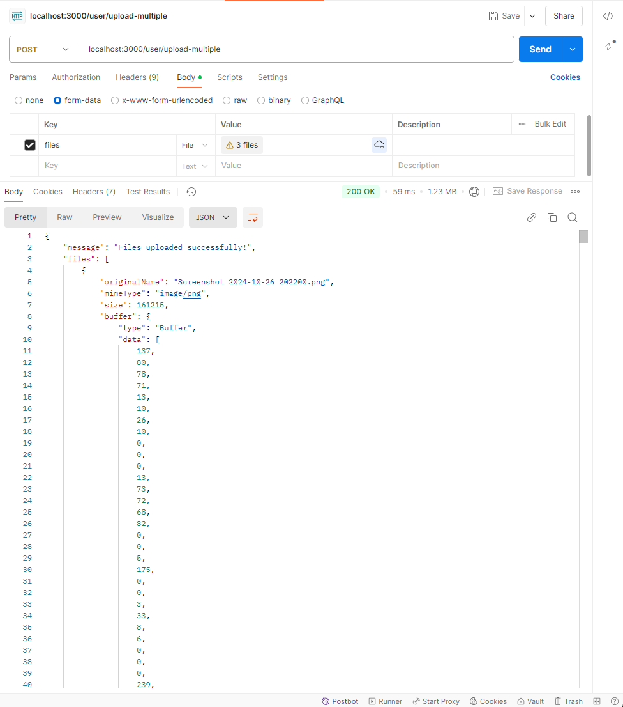
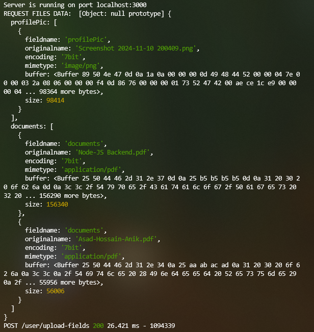
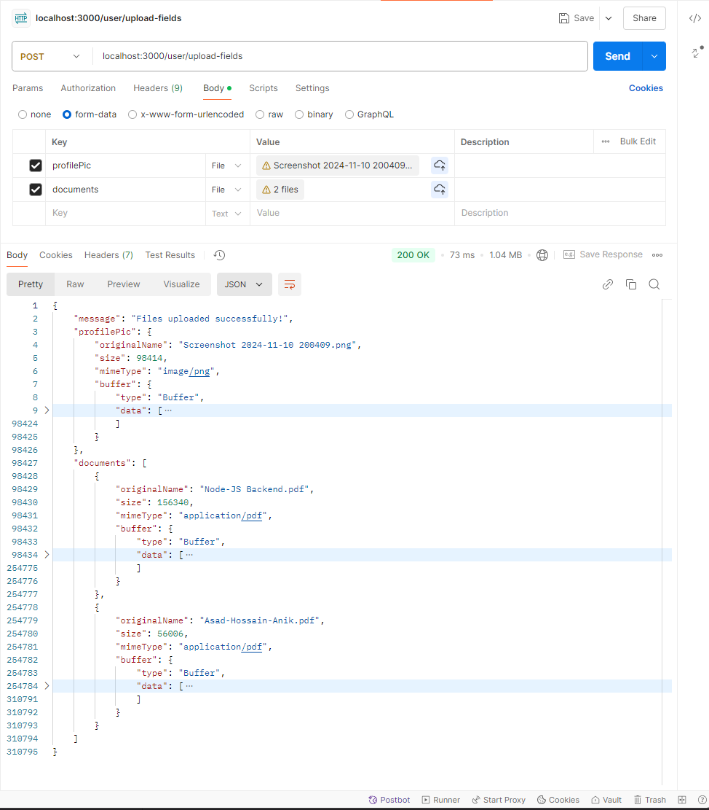

# File Upload & AWS-S3 Bucket Storage

⇒ Multer Package to using with Node

[npm: multer](https://www.npmjs.com/package/multer)

We are going to using Multer with our Node-JS project hands on. Now we have to see how can we grab a file from client side to server side via Multer.

Let’s installing the Multer like this way,

—> **`npm install --save multer`**

Now the questions comes in where should we keeping the Multer module into our project ? what is the best practices to keeping it. 

- **Simple Projects**: Place Multer configuration in `utils/` for simplicity.
- **Complex Projects**: Use `services/` if file uploads are tied to business logic, or `lib/` if you're building a wrapper for Multer or similar libraries.

The choice depends on your project size and modularity needs.

**⇒ So we are keeping the Multer inside `lib/` directory**

Also let’s see by using with first time we are going to uploading a file with that. 😇

- **`my-app/src/lib/multer.ts`**
    
    ```tsx
    import multer from 'multer';
    
    const upload = multer({
    	dest: "./uploads"
    });
    
    export default upload;
    ```
    

Now using the Multer middleware into the route to getting the file for req object.

**⇒ Route for using the uploader middleware here**

- **`my-app/src/routes/index.ts`**
    
    ```tsx
    import { Router, Request, Response } from 'express';
    import MulterUpload from '../lib';
    
    const router = Router();
    
    router.post("/files", upload.single('avatar'), (req: Request, res: Response) => {
    	try {
          // req.file is the file that was uploaded
          console.log("REQ OBJECT HERE - ", req.file);
          res.status(200).json({
    	      message: "File Uploaded",
    	       file: req.file,
          });
          
    	 } catch (error: any) {
    	   res.status(error.statusCode || 500).json({
    	    message: error.message || "Internal Server Error",
    	   });
      }
    });
    
    export default router;
    ```
    

**⇒ Here is the Response from Postman**

Also file is uploaded into the `uploads` directory into the project.



<aside>
💡

This file has no extension or any type given so we have to do something more into the Multer configuration. Also we needs a global error handler for Multer error catching.

</aside>

### Using Proper File Uploading with Node-JS (Express) TypeScript

Firstly, we have our server / application file of Express server with TypeScript here.

**⇒ Server File**

- **`my-app/src/app.ts`**
    
    ```tsx
    import express, { Application, Request, Response, NextFunction } from "express";
    import { userRoute } from "./routes";
    import { multerErrorHandler } from "./middlewares";
    
    const app: Application = express();
    
    // Common Middlewares
    app.use(express.json());
    app.use(express.urlencoded({ extended: true }));
    
    // Routes
    app.use("/user", userRoute);
    
    app.use("*", (_req: Request, res: Response, _next: NextFunction) => {
      res.status(404).json({
        message: "Not Found",
      });
    });
    
    // Error Handling Middleware
    app.use(multerErrorHandler);
    
    // Global Error Handler
    app.use(globalErrorHandler);
    
    const PORT: number = Number(process.env.PORT) || 3000;
    const HOST: string = process.env.HOST || "localhost";
    
    app.listen(PORT, HOST, () => {
      console.log(`Server is running on port ${HOST}:${PORT}`);
    });
    ```
    

**⇒ Now our Multer Config as Library Module**

- **`my-app/src/lib/multer.ts`**
    
    ```tsx
    import multer from "multer";
    
    const upload = multer({
      dest: "uploads/",
    });
    
    export default upload;
    ```
    

**⇒ Error Handler Middleware for Multer Global**

- **`my-app/src/middlewares/error.middleware.ts`**
    
    ```tsx
    import { Request, Response, NextFunction } from "express";
    import { MulterError } from "multer";
    
    /**
     * @desc Handle multer errors
     * @param error 
     * @param req 
     * @param res 
     * @param next 
     */
    export const multerErrorHandler = (
        error: Error, 
        _req: Request, 
        res: Response, 
        next: NextFunction
    ) => {
        if (error instanceof MulterError) {
            if (error.code === "LIMIT_UNEXPECTED_FILE") {
                res.status(400).json({
                    message: 'Unexpected field name. Please use "avatar" as the field name for file upload.',
                    error: error.message,
                });
    
            } else {
                res.status(400).json({
                    message: "File upload failed",
                    error: error.message,
                });
            }
        }
    
        next(error);
    };
    
    /**
     * @desc Global error handler
     * @param error 
     * @param req 
     * @param res 
     * @param next 
     */
    export const globalErrorHandler = (error: any, _req: Request, res: Response, _next: NextFunction) => {
        res.status(error.statusCode || 500).json({
            message: error.message || "Internal Server Error",
        });
    };
    ```
    

**⇒ Proper Route for files upload with User resource**

- **`my-app/src/routes/user.route.ts`**
    
    ```tsx
    import { Router } from "express";
    import { upload } from "../lib";
    import { UserController } from "../controllers";
    const router: Router = Router();
    
    // Initialize the controller
    const userController: UserController = new UserController();
    
    /**
     * @route POST /upload
     * @desc Upload a file
     * @access Public
     */
    router.post("/upload", upload.single("avatar"), userController.uploadFile);
    
    export default router;
    ```
    

**⇒ Mainly here is our Controller as of now we never used Service**

There is no any extra business logics, therefore we used only Controller to manage the request directly here and give us the response of file.

- **`my-app/src/controllers/user.controller.ts`**
    
    ```tsx
    import { Request, Response, NextFunction } from "express";
    
    class UserController {
        /**
         * @route POST /upload
         * @desc Upload a file
         * @access Public
         */
        public uploadFile(req: Request, res: Response, next: NextFunction): void {
           try {
                // req.file is the file that was uploaded
                console.log("REQ OBJECT HERE - ", req.file);
                res.status(200).json({
                    message: "File Uploaded",
                    file: req.file,
                });
            } catch (error: any) {
               next(error);
            }
        }
    }
    
    export default UserController;
    ```
    

<aside>
💡

Well here we can upload any files into our application with the help of Multer. Now we have to keep looking the Multer documentation’s to see more options of validation or manipulation of Multer what features are there and what can it do more.

</aside>

**⇒ Multer Doc. by Geekster**

[Introduction to Multer With Example](https://www.geekster.in/articles/introduction-to-multer/)

⇒ Multer In Details Doc. by **LogRocket**

[Multer: Easily upload files with Node.js and Express - LogRocket Blog](https://blog.logrocket.com/multer-nodejs-express-upload-file/)

⇒ Common **MimeTypes** for uploader

[Common MIME types - HTTP | MDN](https://developer.mozilla.org/en-US/docs/Web/HTTP/MIME_types/Common_types)

### Advance options with Multer configurations

We are going to use the advance options for Multer configurations with. And here we can see there using file `limits` represents the limitation of size for each files which we are going to uploading, `fileFilter` is for filtering the files for checking with mimetype or checking with if we are going to uploading different types of files which are are requiring.

- **`my-app/src/lib/multer.ts`**
    
    ```tsx
    import multer from 'multer';
    
    const upload = multer({
    	dest: "./uploads",
    	limit: {
    		fileSize: 5000000, // 5 MB. (Always takes bytes)
    	},
    	
    	fileFilter: (_req, file, cb) => {
    		const fileName = file.mimetype;
    		
    		if (fileName === "image/png" || fileName === "image/jpeg" || fileName === "image/jpg") {
    			cb(null, true);
    		} else {
    			cb(new Error("Invalid file type"));
    		}
    	}
    });
    ```
    

<aside>
💡

Its filters only the image like `png` , `jpeg` and `jpg` formats. Any other format will not be supporting by doing the filter thing. Also added the size limit for each of the files, this will be 5MB of size only supports limit.

</aside>

### Upload files with using Storages

**Storage adding:** We can adding memory for file uploading through storage. And there is 2 types of storage engines like `DiskStorage` and `MemoryStorage`.

- 1. **`diskStorage`**
    - **What it does**: Stores the uploaded files directly on the server's file system.
    - **How it works**:
        - You can specify the directory where files will be stored (`destination`).
        - You can define the file naming logic (`filename`).
    - **Use Cases**:
        - Best suited for **large files** such as **images, videos, audios, or PDFs** that need to be stored persistently.
        - Ideal if you want to process and then move the file to cloud storage (e.g., AWS S3, Google Cloud Storage).
    - **Advantages**:
        - Files are saved immediately to disk, minimizing memory consumption.
        - Suitable for handling large file uploads without overwhelming server memory.
    - **Disadvantages**:
        - Requires server storage space, which can fill up if not managed properly.
        - Potential performance issues for high-traffic applications if files are stored on local disk instead of external storage.
    - **Configuration Example**:
        
        ```tsx
        import multer from 'multer';
        
        const storage = multer.diskStorage({
          destination: (req, file, cb) => {
            cb(null, './uploads'); // Directory to save files
          },
          filename: (req, file, cb) => {
            cb(null, `${Date.now()}-${file.originalname}`); // Custom file name
          },
        });
        
        const upload = multer({ storage });
        
        export default upload;
        ```
        
- 2. **`memoryStorage`**
    - **What it does**: Stores the uploaded files in the server's memory as a Buffer object.
    - **How it works**:
        - Files are kept in memory (RAM) temporarily.
        - You access the file data through `req.file.buffer` for further processing.
    - **Use Cases**:
        - Best for **temporary files** or when you need to process the file (e.g., resize images, parse CSV, or upload directly to a cloud storage service).
        - Suitable for smaller file uploads or when the file is uploaded and processed immediately, without needing to store it persistently.
    - **Advantages**:
        - Faster access to file data as it's in memory.
        - No need to manage local storage, making it ideal for stateless or cloud-first applications.
    - **Disadvantages**:
        - Limited by available server memory (RAM), making it unsuitable for large files.
        - Files are lost if the server restarts or crashes before they are processed.
    - **Configuration Example**:
        
        ```tsx
        import multer from 'multer';
        
        const storage = multer.memoryStorage();
        
        const upload = multer({ storage });
        
        export default upload;
        ```
        
        <aside>
        💡
        
        Files are stored as `Buffer` in memory, accessible through `req.file.buffer`. No `destination` or `filename` logic is required since the file is not saved on the disk.
        
        </aside>
        

**⇒ Which to Use for Specific File Types**

| **File Type** | **Recommended Storage** | **Reason** |
| --- | --- | --- |
| **Images** | `diskStorage` or `memoryStorage` | Use `diskStorage` for persistent storage; `memoryStorage` if resizing or uploading to the cloud. |
| **Videos** | `diskStorage` | Videos are large; storing in memory can overwhelm server RAM. |
| **Audio** | `diskStorage` | Similar to videos, audio files are better suited for disk-based storage. |
| **PDFs/Documents** | `diskStorage` | PDFs are typically not processed immediately, so storing on disk is more efficient. |
| **Temporary Files** | `memoryStorage` | Use if you process and discard the file without storing it. |

**⇒ Key Considerations for Choosing**

1. **File Size**:
    - **Small Files**: Both `diskStorage` and `memoryStorage` work.
    - **Large Files**: Use `diskStorage` to avoid running out of memory.
2. **Processing Needs**:
    - Use `memoryStorage` for files that need immediate processing (e.g., resizing images, sending to cloud).
3. **Persistence**:
    - Use `diskStorage` for files that need to be stored locally before being moved elsewhere.
4. **Server Resources**:
    - Consider your server's RAM and disk capacity to avoid bottlenecks.

**⇒ Hybrid Approach**

For a balanced approach:

1. Use `memoryStorage` for **small files** or files that are processed immediately.
2. Use `diskStorage` for **large files** and then offload them to cloud storage or a CDN.

Let me know if you need help setting up a specific use case!

### Multiple files uploading system

We are going to see how can we upload files by using both Disk / Memory storage using.

**`diskStorage` for multiple files uploading**

Files are stored directly on disk.

- **`my-app/src/routes/user.route.ts`**
    
    ```tsx
    import { Router } from "express";
    import { upload } from "../lib";
    import { UserController } from "../controllers";
    const router: Router = Router();
    
    // Initialize the controller
    const userController: UserController = new UserController();
    
    /**
     * @route POST /upload-multiple
     * @desc Upload multiple files
     * @access Public
     */
    router.post("/upload-multiple", upload.array("files", 5), userController.uploadFile);
    
    export default router;
    ```
    

Now let’s see the configuration how will be looks like with some file filtering feature of Multer.

- **`my-app/src/lib/multer.ts`**
    
    ```tsx
    import multer from "multer";
    
    const storage = multer.diskStorage({
    	destination: (req, file, cb) => {
    		cb(null, './uploads'); // Directory to save files
    	},
    	filename: (req, file, cb) => {
    		cb(null, `${Date.now()}-${file.originalname}`); // Custom file name
    	},
    });
    
    const upload = multer({ storage });
    
    export default upload;
    ```
    
    And, if we are using with some more options like files filtering according to the file types. It will provide us the power of choosing which types of files only we are going to allow here.
    
    ```tsx
    import multer from 'multer';
    
    const storage = multer.diskStorage({
    	destination: (_req, _file, cb) => {
    		cb(null, './uploads');
    	},
    	filename: (_req, file, cb) => {
    		cb(null, `${Date.now()}-${file.originalname}`);
    	},
    });
    
    // File Filtering Function Here..
    const fileFilter = (_req: Express.Request, file: Express.Multer.File, cb: multer.FileFilterCallback) => {
    	// Allowed files types..
    	const allowedMimeTypes = ['image/jpeg', 'image/png', 'image/jpg', 'image/gif'];
    	
    	if (allowedMimeTypes.includes(file.mimetype)) {
    		cb(null, true);
    	} else {
    		cb(new Error(`Invalid file type: ${file.mimetype} here.`)); // Reject file
    	}
    };
    
    // Using the File Filtering..
    const upload = multer({ 
    	storage,
    	fileFilter,
    	limits: { files: 5, fileSize: 5 * 1024 * 1024 } // Maximum 5 filess, 5MB per file
    });
    
    export default upload;
    ```
    
    <aside>
    💡
    
    Option added for filtering the file before uploading with Multer and added a file size limit and files uploading limits.
    
    </aside>
    

Controller decide how to show them to end user 😜. For now we are just see how the response comes with our multiple files uploading.

- **`my-app/src/controllers/user.controller.ts`**
    
    ```tsx
    import { Request, Response, NextFunction } from "express";
    
    class UserController {
        /**
         * @route POST /upload-multiple
         * @desc Upload a file
         * @access Public
         */
        public uploadFiles(req: Request, res: Response, next: NextFunction): void {
           try {
    		       if (!req.files || req.files.length === 0) {
    			       throw new Error('No files uploaded or file type not allowed.')
    		       }
    		       
    		       // Access the uploaded files here..
    		       const files = req.files as Express.Multer.File[];
    		       const fileDetails = files.map(file => {
    			       return {
    				       originalName: file.originalname,
    				       path: file.path,
    				       size: file.size,
    				       mimeType: file.mimetype,
    				       serverDestination: file.destination,
    			       };
    		       });
    		       
    		       console.log('Uploaded files: ', fileDetails);
         
               res.status(200).json({
                   message: "Files uploaded successfully!",
                   files: fileDetails,
               });
            } catch (error: any) {
                next(error);
            }
        }
    }
    
    export default UserController;
    ```
    

**⇒ Server Terminal (Bash) Console**

The console logs for Request and Response of the API



**⇒ Postman API Response**

Result of uploading multiple images as our API response here.



 **`memoryStorage` for multiple files uploading**

Files are stored in memory as buffers.

Now let’s see the configuration how will be looks like with some file filtering feature of Multer.

- **`my-app/src/lib/multer.ts`**
    
    We are using with some more options like files filtering according to the file types. It will provide us the power of choosing which types of files only we are going to allow here.
    
    ```tsx
    import multer from 'multer';
    
    // Memory storage configuration
    const storage = multer.memoryStorage();
    
    // File filter function
    const fileFilter = (_req: Express.Request, file: Express.Multer.File, cb: multer.FileFilterCallback) => {
      // Allowed file types
      const allowedMimeTypes = ['image/jpeg', 'image/png', 'image/jpg', 'image/gif'];
    
      if (allowedMimeTypes.includes(file.mimetype)) {
        cb(null, true); // Accept the file
      } else {
        cb(new Error(`Invalid file type: ${file.mimetype} here.`)); // Reject the file
      }
    };
    
    // Multer configuration with memoryStorage and file filter
    const upload = multer({
      storage,
      fileFilter,
      limits: {
        files: 5, // Maximum 5 files
        fileSize: 5 * 1024 * 1024, // Maximum 5MB per file
      },
    });
    
    export default upload;
    ```
    
    <aside>
    💡
    
    Option added for filtering the file before uploading with Multer and added a file size limit and files uploading limits.
    
    </aside>
    

When we see into this controller this is slightly different from diskStorage controller. Basically in memoryStorage we are getting the file as buffers. Therefore, we are using the `file.buffer` as this is here only and its the temporary data which is stored into the RAM.

- **`my-app/src/controllers/user.controller.ts`**
    
    ```tsx
    import { Request, Response, NextFunction } from "express";
    
    class UserController {
      /**
       * @route POST /upload-multiple
       * @desc Upload multiple files (stored in memory)
       * @access Public
       */
      public uploadFiles(req: Request, res: Response, next: NextFunction): void {
        try {
          if (!req.files || (req.files as Express.Multer.File[]).length === 0) {
            throw new Error("No files uploaded or file type not allowed.");
          }
    
          // Access the uploaded files (stored in memory)
          const files = req.files as Express.Multer.File[];
          const fileDetails = files.map((file) => {
            return {
              originalName: file.originalname,
              size: file.size,
              mimeType: file.mimetype,
              buffer: file.buffer, // File data stored as Buffer
            };
          });
    
          console.log("Uploaded files: ", fileDetails);
    
          res.status(200).json({
            message: "Files uploaded successfully!",
            files: fileDetails,
          });
        } catch (error: any) {
          next(error);
        }
      }
    }
    
    export default UserController;
    ```
    
    <aside>
    💡
    
    As we can see the file buffer we can access as for memory storage saved. This buffer data is directly came from RAM which is temporary data. If any crashes happens then it will be lost immediately. This is good to do something immediate action with the files.
    
    </aside>
    

**⇒ Server Terminal (Bash) Console**

The console logs for Request and Response of the API



**⇒ Postman API Response**

Result of uploading multiple images as our API response here.



### Multi fields file uploading system

In the multi-fields file we are basically uploads the multiple form fields as multiple files. And we can take control each of the files and decide the specific filtering and specific actions.

So, we can do with an example of uploading one image file with maximum 5 pdf files. And here always use `multer.fields()` to handle multiple fields.

- `profilePic` accepts 1 file (Profile Image).
- `documents` accepts up to 5 files (PDF or text files).

<aside>
💡

We can use any storage system for this one. The configuration of the Multer will be same as like before. Then only the changes we are going to looking forward here.

</aside>

- **`my-app/src/routes/user.route.ts`**
    
    ```tsx
    import { Router } from "express";
    import { upload } from "../lib";
    import { UserController } from "../controllers";
    const router: Router = Router();
    
    // Initialize the controller
    const userController: UserController = new UserController();
    
    /**
     * @route POST /upload-multiple
     * @desc Upload multiple files
     * @access Public
     */
    router.post("/upload-fields", upload.fields([
        { name: 'profilePic', maxCount: 1 },
        { name: 'documents', maxCount: 5 },
    ]), userController.uploadFile);
    
    export default router;
    ```
    
- **`my-app/src/controllers/user.controller.ts`**
    
    ```tsx
    import { Request, Response, NextFunction } from 'express';
    
    class UserController {
    	  /**
         * @route POST /upload-multi-fields
         * @desc Upload files to multiple fields
         * @access Public
         */
        public uploadMultiFields(req: Request, res: Response, next: NextFunction): void {
            try {
                const files = req.files as {
                    [fieldname: string]: Express.Multer.File[];
                };
                const profilePic = files['profilePic']?.[0]; // Single File
                const documents = files['documents'] || []; // Array of Files
    
                console.log('REQUEST FILES DATA: ', req.files);
    
                // Access files for `profilePic`
                const profilePicDetails = profilePic ? {
                    originalName: profilePic.originalname,
                    size: profilePic.size,
                    mimeType: profilePic.mimetype,
                    buffer: profilePic.buffer, // File data in memory
                }
    		            : null;
    
                // Access files for `documents`
                const documentDetails = documents.map((doc) => ({
                    originalName: doc.originalname,
                    size: doc.size,
                    mimeType: doc.mimetype,
                    buffer: doc.buffer,
                }));
    
                res.status(200).json({
                    message: 'Files uploaded successfully!',
                    profilePic: profilePicDetails,
                    documents: documentDetails,
                });
            } catch (error: any) {
                next(error);
            }
        }
    }
    
    export default UserController;
    ```
    

**⇒ Server Terminal (Bash) Console**

The console logs for Request and Response of the API



**⇒ Postman API Response**

Result of uploading multiple images as our API response here.



## Cloud storage upload (AWS-S3 Bucket)

We are using the cloud system to keeping data inside third party service. The service that will take care of our files and storage managements. 

**⇒ AWS SDK for Node (JavaScript/TypeScript) Applications**

**v2** Developers Guide Here:

[Getting Started in Node.js - AWS SDK for JavaScript](https://docs.aws.amazon.com/sdk-for-javascript/v2/developer-guide/getting-started-nodejs.html)

**v3** Developers Guide Here:

[Get started with Node.js - AWS SDK for JavaScript](https://docs.aws.amazon.com/sdk-for-javascript/v3/developer-guide/getting-started-nodejs.html)

**⇒ Complete Guide for AWS SDK JavaScript**

[docs.aws.amazon.com](https://docs.aws.amazon.com/pdfs/sdk-for-javascript/v3/developer-guide/js-sdk-dg.pdf#getting-started-nodejs)

**Using with Linode**

Linode Object Storage is an S3-compatible service offering a cost-effective, beginner-friendly alternative to AWS S3. The steps for interacting with it are the same as AWS S3 because Linode adheres to the same API standards.

**Advantages of Using `Linode`**

1. **Familiarity with AWS SDK**: You still use the same tools and codebase as AWS S3.
2. **Cost Efficiency**: Great for learning without incurring high AWS costs.
3. **Scalability**: Linode Object Storage is reliable and can scale as your needs grow.

**⇒ NPM Package for Installing AWS-SDK**

[npm: aws-sdk](https://www.npmjs.com/package/aws-sdk)

**Start with Linode and Node (TypeScript) Application**

Here we showed AWS SDK v2 and v3 both. You have to use only one of them not both of them. We preferred to using v3 SDK. 

- 1. **Create a Linode Account**
    1. Visit [Linode's Website](https://www.linode.com/).
    2. Sign up for a free account (you might get free credits for starting).
    3. Verify your email address.

---

- 2. **Set Up an Object Storage Bucket**
    1. Log in to the Linode Cloud Manager.
    2. Go to **Object Storage** in the sidebar.
    3. Click **Create a Bucket**.
        - Choose a **bucket name** (e.g., `my-bucket`).
        - Select a **region** (e.g., `us-east-1`).
        - Click **Create Bucket**.
    4. Your bucket is ready!

---

- 3. **Generate API Keys**
    1. Go to **API Tokens** in the sidebar.
    2. Click **Create a Personal Access Token**.
        - Give it a name (e.g., `S3 Access`).
        - Set **Object Storage Read/Write** permissions.
    3. Save the **Access Key** and **Secret Key**—you’ll use these later.

---

- 4. **Install AWS SDK v2**
    
    To interact with Linode Object Storage, install the AWS SDK for JavaScript.
    
    —> **`npm install aws-sdk`** 
    
    —> `npm install --save-dev @types/aws-sdk` (If using with **TypeScript**)
    

---

- 4. **Install AWS SDK v3**
    
    To interact with Linode Object Storage, install the AWS SDK for JavaScript.
    
    —> **`npm install @aws-sdk/client-s3`** 
    

Simple configuration here about S3 Bucket configure by using with `Linode`. Linode is using to make the process easier to interacting with AWS services.

- **`my-app/src/lib/s3bucket.ts`**
    
    **→ v2** AWS SDK for S3
    
    ```tsx
    import S3 from 'aws-sdk/clients/s3';
    
    const s3Bucket = new S3({
    	accessKeyId: process.env.ACCESS_KEY,
    	secretAccessKey: process.env.SECRET_KEY,
    	region: process.env.REGION,
    	endpoint: process.env.ENDPOINT,
    	s3ForcePathStyle: true,
    });
    
    /**
     * UPLOADER OF S3 BUCKET
     * @param {Buffer | String} file
     * @param {String} fileName 
     * @returns 
     */
    const s3Uploader = async(file: Buffer | string, fileName: string) => {
       const bucketName = process.env.BUCKET_NAME;
    
        if (!bucketName) {
            throw new Error('S3 Bucket name is not defined in the env.');
        }
    
    		const params = {
    			Bucket: bucketName,
    			Key: fileName,
    			Body: file,
    			ACL: "public-read",
    		};
    	
    		try {
    			const uploadResult = await s3Bucket.upload(params).promise();
    			console.log('File uploaded successfully: ', uploadResult.Location);
    			return uploadResult.Location; // Return the file URL
    	
    		} catch(error) {
    			console.error(`Error uploading to s3: ${error}`);
    			throw new Error('Failed to upload file to s3');
    		}
    };
    
    export default s3Uploader;
    ```
    
    → **v3** AWS SDK for S3
    
    ```tsx
    import { S3Client, PutObjectCommand, ObjectCannedACL } from '@aws-sdk/client-s3';
    
    const s3Client = new S3Client({
        region: process.env.REGION as string,
        endpoint: process.env.ENDPOINT as string,
        credentials: {
            accessKeyId: process.env.ACCESS_KEY as string,
            secretAccessKey: process.env.SECRET_KEY as string,
        },
    });
    
    /**
     * UPLOADER OF S3 BUCKET
     * @param {Buffer | String} file
     * @param {String} fileName 
     * @returns 
     */
    const s3Uploader = async (file: Buffer | string, fileName: string): Promise<string> => {
        const bucketName = process.env.BUCKET_NAME;
        
        if (!bucketName) {
    	    throw new Error('S3 Bucket name is not defined in the env.');
        }
        
        const params = {
            Bucket: bucketName,
            Key: fileName, // Use fileName as the key
            Body: file,
            ACL: "public-read" as ObjectCannedACL,
        };
        
        try {
    	    const command = new PutObjectCommand(params);
    	    await s3Client.send(command);
    	    
    	    const publicURL: string = `${process.env.ENDPOINT}${bucketName}/${fileName}`;
    	    console.log(`File Uploaded Successfully: ${publicURL}`);
    	    return publicURL; // Return the file URL
        
        } catch (error) {
    	    console.error(`Error uploading to s3: ${error}`);
    		throw new Error('Failed to upload file to s3');
        }
    };
    
    export default s3Uploader;
    ```
    
    <aside>
    💡
    
    We are gathering the `ACCESS_KEY`, `SECRET_KEY`, `REGION`, `ENDPOINT` all the secret things from Linode after creating Bucket on there.
    
    **NOTE:**  We also can import like this way `import AWS from 'aws-sdk';`  and then saying the constructor method like this `new AWS.S3();` . But this is not the optimized way if we are only using the S3 Bucket only from entire AWS services. That’s why we are imported with this way `import S3 from 'aws-sdk/clients/s3';` which reduces to importing entire AWS services and keeps import only one service at a time, and this is convenient way.
    
    </aside>
    

So that time we don’t need any storage for file uploading into the file storage system. Instead of that we are using the cloud storage s3 to taking care our file.

Now let’s using the AWS uploader for uploading our files from multer.

- **`my-app/src/controller/user.controller.ts`**
    
    ```tsx
    import { Request, Response, NextFunction } from 'express';
    import { aws } from '../lib';
    
    class UserController {
        /**
         * @route POST /upload-cloud
         * @desc Upload file to cloud
         * @param req 
         * @param res 
         * @param next 
         */
        public async uploadToCloud(req: Request, res: Response, next: NextFunction): Promise<void> {
            try {
                if (!req.file) {
                   throw new Error('No File Provided!');
                }
    
                const file = req.file.buffer; // Assuming multer memory storage
                const fileName = `${Date.now()}-${req.file.originalname}`;
    
                // Upload the file to S3
                const fileUrl = await aws.s3Uploader(file, fileName);
    
                res.status(200).json({
                    message: 'File uploaded successfully',
                    fileUrl,
                });
    
            } catch (error: any) {
                next(error);
            }
        }
    }
    
    export default UserController;
    ```
    
    <aside>
    💡
    
    `Response after uploading file to S3 Bucket.`
    
    {
        "message": "File uploaded successfully",
        "fileUrl": "https://<endpoint>/<bucket_name>/<file_name>"
    }
    
    </aside>